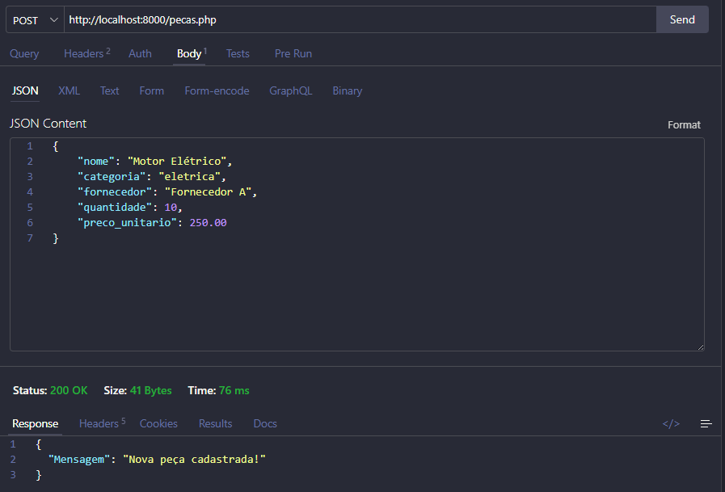
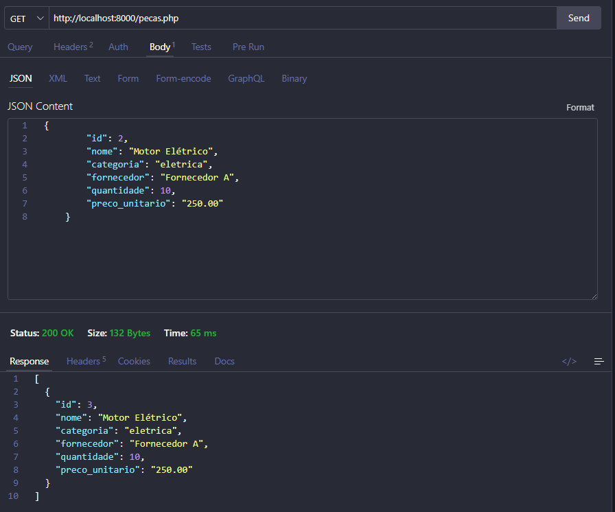
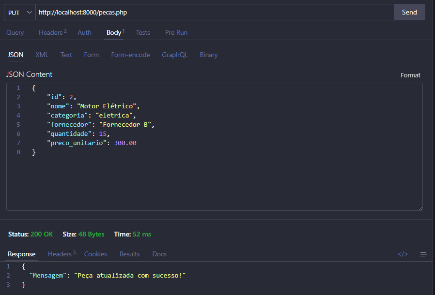
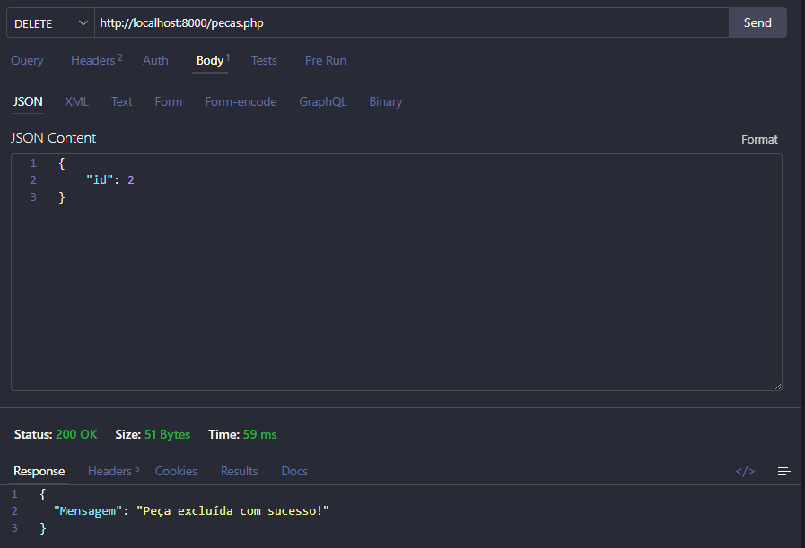
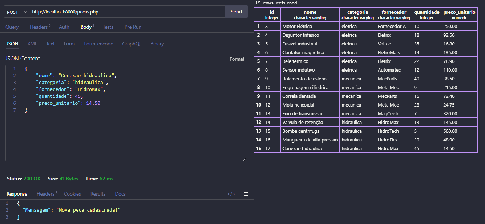
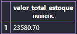
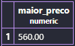
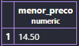
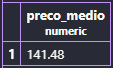
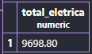

# API de Controle de Peças - Almoxarifado

## Projeto

API desenvolvida em PHP para o controle de peças de reposição armazenadas em um almoxarifado.
O sistema permite cadastrar, consultar, atualizar e excluir peças utilizando uma API com as operações básicas do CRUD.

## Tecnologias utilizadas

- PHP
- PostgreSQL
- PDO
- JSON
- Thunder Client

## Banco de Dados

O banco de dados utilizado no projeto é:

```sql
CREATE DATABASE almoxarifado;
```

A tabela utilizada é:

```sql
CREATE TABLE pecas (
    id SERIAL PRIMARY KEY,
    nome VARCHAR(100),
    categoria VARCHAR(100),
    fornecedor VARCHAR(100),
    quantidade INTEGER,
    preco_unitario DECIMAL(10,2)
);
```

### Campos da tabela

| Campo | Tipo | Descrição |
|---|---|---|
| id | SERIAL | Identificador da peça |
| nome | VARCHAR | Nome da peça |
| categoria | VARCHAR | Categoria da peça |
| fornecedor | VARCHAR | Fornecedor da peça |
| quantidade | INTEGER | Quantidade disponível |
| preco_unitario | DECIMAL | Preço de cada unidade |

## Conexão com o banco

A conexão com o banco de dados é realizada através do arquivo:

```text
conexao.php
```

A API utiliza PDO para realizar a comunicação entre o PHP e o PostgreSQL.

## Funcionamento da API

A API utiliza o arquivo:

```text
pecas.php
```

### POST - Cadastrar peça

**URL:**

```text
http://localhost:8000/pecas.php
```

**Método:**

```text
POST
```

**JSON enviado:**

```json
{
    "nome": "Motor Elétrico",
    "categoria": "eletrica",
    "fornecedor": "Fornecedor A",
    "quantidade": 10,
    "preco_unitario": 250.00
}
```

**Resposta:**

```json
{
    "Mensagem": "Nova peça cadastrada!"
}
```



---

### GET - Listar peças

**URL:**

```text
http://localhost:8000/pecas.php
```

**Método:**

```text
GET
```

A operação retorna todas as peças cadastradas no banco de dados.

**Exemplo de resposta:**

```json
[
    {
        "id": 2,
        "nome": "Motor Elétrico",
        "categoria": "eletrica",
        "fornecedor": "Fornecedor A",
        "quantidade": 10,
        "preco_unitario": "250.00"
    }
]
```



---

### PUT - Atualizar peça

**URL:**

```text
http://localhost:8000/pecas.php
```

**Método:**

```text
PUT
```

**JSON enviado:**

```json
{
    "id": 2,
    "nome": "Motor Elétrico",
    "categoria": "eletrica",
    "fornecedor": "Fornecedor B",
    "quantidade": 15,
    "preco_unitario": 300.00
}
```

**Resposta:**

```json
{
    "Mensagem": "Peça atualizada com sucesso!"
}
```



---

### DELETE - Excluir peça

**URL:**

```text
http://localhost:8000/pecas.php
```

**Método:**

```text
DELETE
```

**JSON enviado:**

```json
{
    "id": 2
}
```

**Resposta:**

```json
{
    "Mensagem": "Peça excluída com sucesso!"
}
```




## Cadastro de peças

Cadastro das peças utilizando o método **POST** da API.

Foram cadastradas **15 peças**, distribuídas entre as categorias **elétrica, mecânica e hidráulica**, com diferentes fornecedores, quantidades e preços unitários.

A requisição foi testada utilizando o **Thunder Client**.




## Consultas SQL

### 1. Quantidade total de peças

Consulta utilizada para descobrir quantas unidades existem no almoxarifado:

```sql
SELECT SUM(quantidade) AS total_unidades
FROM pecas;
```


### 2. Valor total do estoque

A quantidade é multiplicada pelo preço unitário para descobrir o valor total do estoque:

```sql
SELECT SUM(quantidade * preco_unitario) AS valor_total_estoque
FROM pecas;
```



### 3. Preço da peça mais cara

```sql
SELECT MAX(preco_unitario) AS maior_preco
FROM pecas;
```



### 4. Preço da peça mais barata

```sql
SELECT MIN(preco_unitario) AS menor_preco
FROM pecas;
```



### 5. Preço médio das peças

A função `ROUND` é utilizada para apresentar o resultado com duas casas decimais:

```sql
SELECT ROUND(AVG(preco_unitario), 2) AS preco_medio
FROM pecas;
```



### 6. Valor total das peças da categoria elétrica

```sql
SELECT SUM(quantidade * preco_unitario) AS valor_total_eletrica
FROM pecas
WHERE categoria = 'eletrica';
```



## Testes

Os testes da API foram realizados utilizando o Thunder Client.

Foram realizados testes com os seguintes métodos:

- POST para cadastrar peças;
- GET para listar as peças;
- PUT para atualizar uma peça;
- DELETE para excluir uma peça.

Também foram executadas as consultas SQL no PostgreSQL para analisar os dados cadastrados.

## Conclusão

O projeto permitiu desenvolver uma API em PHP para o controle de peças de um almoxarifado, utilizando PostgreSQL, PDO, JSON e as operações básicas de CRUD.

Também foram utilizadas consultas SQL com as funções `SUM`, `MAX`, `MIN`, `AVG` e `ROUND`, além das cláusulas `AS` e `WHERE`.